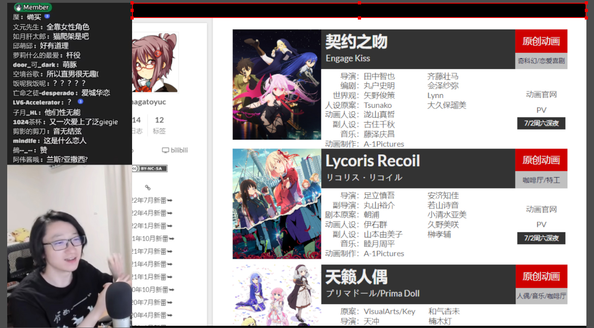
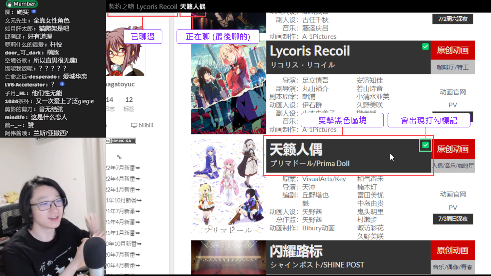

# OBS 直播時標記動漫

一個本地小工具，可以在直播時標記已經聊過的動漫，讓比較晚來的觀眾可以馬上了解現在的直播進度。

## 安裝

伺服器端 (需要先安裝 [Node.js](https://nodejs.org/))：

```bash
npm install
```

客戶端 (需要先安裝 Tampermonkey 油猴腳本)：

* YuC's AnimeList ([yuc.wiki](https://yuc.wiki/)) - [點擊安裝](https://raw.githubusercontent.com/wang48372162/obs-animes-markup/main/clients/yuc_wiki.user.js)

## 使用

啟動伺服器：

```
npm run start
```

在啟動伺服器之後要刷新 yuc.wiki 頁面。

開啟 OBS，新增一個「瀏覽器」來源，網址處貼上，「http://localhost:2233」，寬度「1200」，高度「40」，清空自訂CSS，最後調整成以下位置及大小即可：



*※ 部份畫面截圖自 [【泛式/录播】七月新番杂谈回，你也很想看粉毛切片对吧？](https://www.bilibili.com/video/BV1nZ4y1Y7VH)*

之後只要在講到某部番劇時，**雙擊黑色區塊**，右上角將會出現打勾標記，以及直播頁面上方會自動更新番劇名稱：



> **Warning**: 直播頁面上方的區塊以及 yuc.wiki 頁面中的打勾，都是重新整理頁面就會清空，需要注意。

## 別名

在 `alias.js` 中可以定義番劇名稱的縮寫，讓直播畫面顯示比較短的別名，既可以讓畫面比較簡潔，又可以顯示熟悉的譯名。

比如在 yuc.wiki 中「继母的女儿是我的前女友」比較常念另一個翻譯「拖油瓶」，就可以在 `alias.js` 裡定義：

```js
module.exports = {
  // 'yuc.wiki 上顯示的名稱': '這裡就寫喜歡的譯名',
  '继母的女儿是我的前女友': '拖油瓶',
  '异世界归来的舅舅': '异世界舅舅',
  'RWBY冰雪帝国': 'RWBY',
  '欢迎来到实力至上主义的教室 第2期': '实教',
}
```
